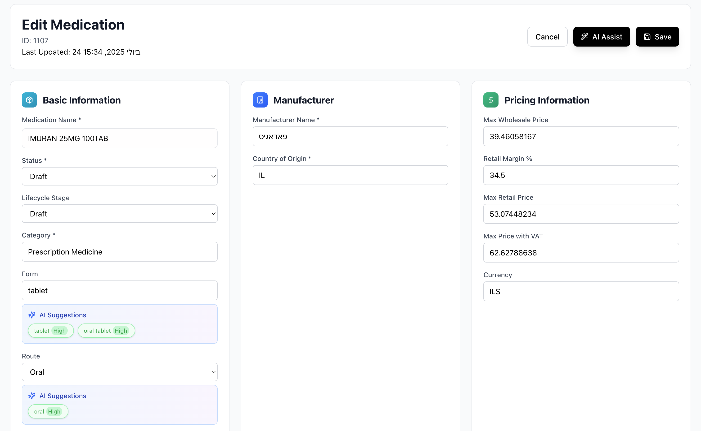

# OpenMed - Open Source Medical Catalog for Israel

<div align="center">
  
  
  **Simple, Accurate, and Efficient Medical Catalog System**
  
  [](https://opensource.org/licenses/MIT)
  [](https://python.org)
  [](https://nextjs.org)
</div>

## What is OpenMed?

OpenMed is a comprehensive open-source medical catalog system designed specifically for the Israeli healthcare system. It provides both a REST API for programmatic access and a modern web interface for easy browsing and management of medication data.

### Key Features

- 🏥 **Israeli Healthcare Focus**: Specialized for Israeli medical regulations and standards
- 🔍 **Advanced Search**: Find medications by name, manufacturer, status, and category
- 🤖 **AI-Powered Suggestions**: Intelligent field completion and data validation
- 📱 **Modern Web Interface**: Clean, responsive design for easy navigation
- 🔧 **REST API**: Simple endpoints for integration with other systems
- 📊 **Comprehensive Data**: Detailed medication information including composition, pricing, and clinical data

## Screenshot

<div align="center">
  
</div>

## Project Structure

```
OpenMed/
├── web/                       # Next.js web application
│   ├── src/
│   │   ├── app/              # App router pages
│   │   ├── components/       # React components
│   │   ├── lib/              # Utility functions
│   │   └── types/            # TypeScript definitions
│   ├── public/               # Static assets
│   └── package.json          # Node.js dependencies
├── api/                      # Python Flask REST API
│   └── app.py
├── catalog/                  # Generated medication data
│   ├── *.json               # Individual medication files
│   └── catalog_index.json   # Search index
├── schema/                   # JSON schemas
│   └── openmed_medication.schema.json
├── scripts/                  # Data processing scripts
└── assets/                   # Logo and screenshots
```

## Quick Start

### Prerequisites

- **Python 3.8+** (for API)
- **Node.js 18+** (for web app)
- **1GB RAM minimum**
- **100MB disk space**

### 1. Clone and Setup

```bash
# Clone repository
git clone https://github.com/formidablecare/openmed.git
cd openmed

# Setup Python environment
python -m venv venv
source venv/bin/activate  # On Windows: venv\Scripts\activate
pip install -r requirements.txt

# Setup web application
cd web
npm install
```

### 2. Generate Catalog Data

```bash
# From project root
python scripts/generate_catalog_index.py
```

### 3. Start the Services

#### Start the API Server

```bash
# From project root
python api/app.py
```

API will be available at `http://localhost:5001`

#### Start the Web Application

```bash
# From web directory
cd web
npm run dev
```

Web app will be available at `http://localhost:3000`

### 4. Optional: Configure AI Features

For AI-powered suggestions, create a `.env.local` file in the `web/` directory:

```bash
# Copy example file
cp web/env.example web/.env.local

# Edit with your API keys
nano web/.env.local
```

Supported AI providers:

- OpenAI (GPT-4, GPT-3.5)
- Anthropic (Claude)
- Google AI (Gemini)
- Azure OpenAI

## Usage

### Web Interface

1. **Browse Medications**: Navigate through the medication catalog with search and filters
2. **View Details**: Click on any medication to see comprehensive information
3. **Edit Data**: Use the edit mode to modify medication information with AI assistance
4. **AI Suggestions**: Click "AI Assist" to get intelligent suggestions for empty fields

### API Endpoints

| Endpoint            | Method | Description                     |
| ------------------- | ------ | ------------------------------- |
| `/medications`      | GET    | List medications (with filters) |
| `/medications/{id}` | GET    | Get specific medication         |
| `/manufacturers`    | GET    | Get all manufacturers           |
| `/categories`       | GET    | Get all categories              |
| `/health`           | GET    | Health check                    |

#### Example API Usage

```bash
# Search for medications
curl "http://localhost:5001/medications?search=amoxicillin"

# Get specific medication
curl "http://localhost:5001/medications/MOH_12345"

# Filter by status and category
curl "http://localhost:5001/medications?status=active&category=Antibiotics"
```

## Data Schema

Each medication follows the `OpenMedMedication` schema with comprehensive fields:

```json
{
  "resourceType": "OpenMedMedication",
  "id": "MOH_12345",
  "name": "Amoxicillin 500mg capsule",
  "status": "active",
  "category": "Antibiotics",
  "composition": [
    {
      "substance": "Amoxicillin",
      "concentration": {
        "value": 500,
        "unit": "mg"
      }
    }
  ],
  "manufacturer": {
    "name": "Teva Pharmaceuticals",
    "country": "IL"
  },
  "pricing": {
    "maxRetailPrice": 15.5,
    "currency": "ILS"
  }
}
```

## Development

### Running Tests

```bash
# Test API
curl http://localhost:5001/health

# Test web app
cd web
npm run lint
npm run build
```

### Code Quality

```bash
# Python formatting
black api/ scripts/

# Web app formatting
cd web
npm run format
```

## Contributing

1. Fork the repository
2. Create a feature branch
3. Make your changes
4. Add tests if applicable
5. Submit a pull request

## License

This project is licensed under the MIT License - see the [LICENSE](LICENSE) file for details.

---

<div align="center">
  **OpenMed - Empowering Healthcare with Open Data 🎯**
  
  Built with ❤️ for the Israeli healthcare community
</div>
